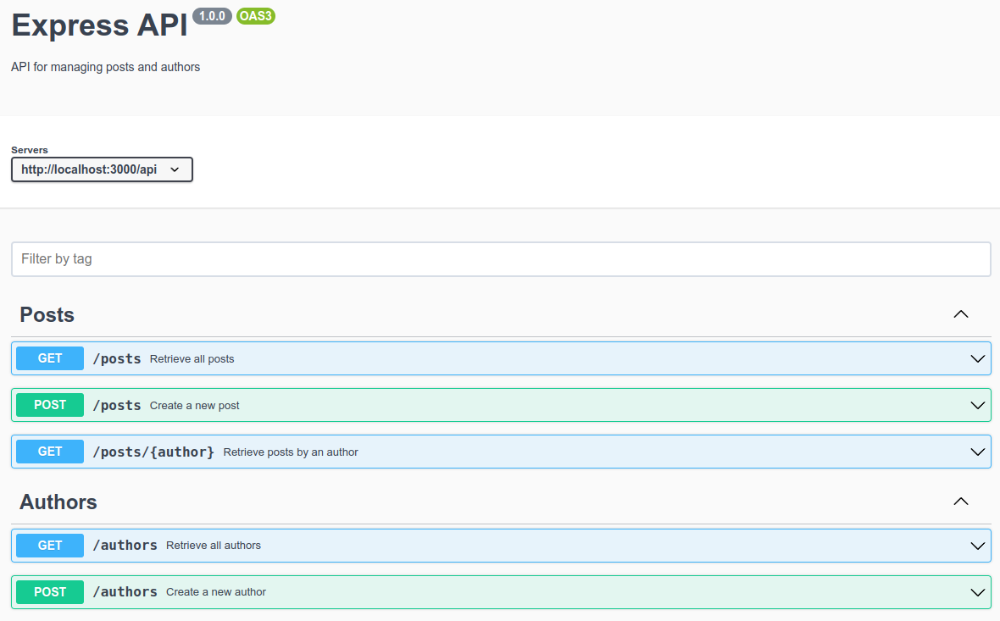

# Express application for API Blogger, reduced version.

# API query list 
Tasks to acomplish:
  - DB creation with tables and all the fields.
  - Creation of the Express project.
  - Creation of the necessary routes to establish the API base.
  - Creation of the URLs for the recovery and creation of new posts within the database.
  - Creation of the necessary URLs for the recovery and creation of new authors within the database.
  - Creation of the route that allows us to recover all the posts of a specific author from the recovery of said author from the URL.

# Take a look at blogapp_openapi.yaml

